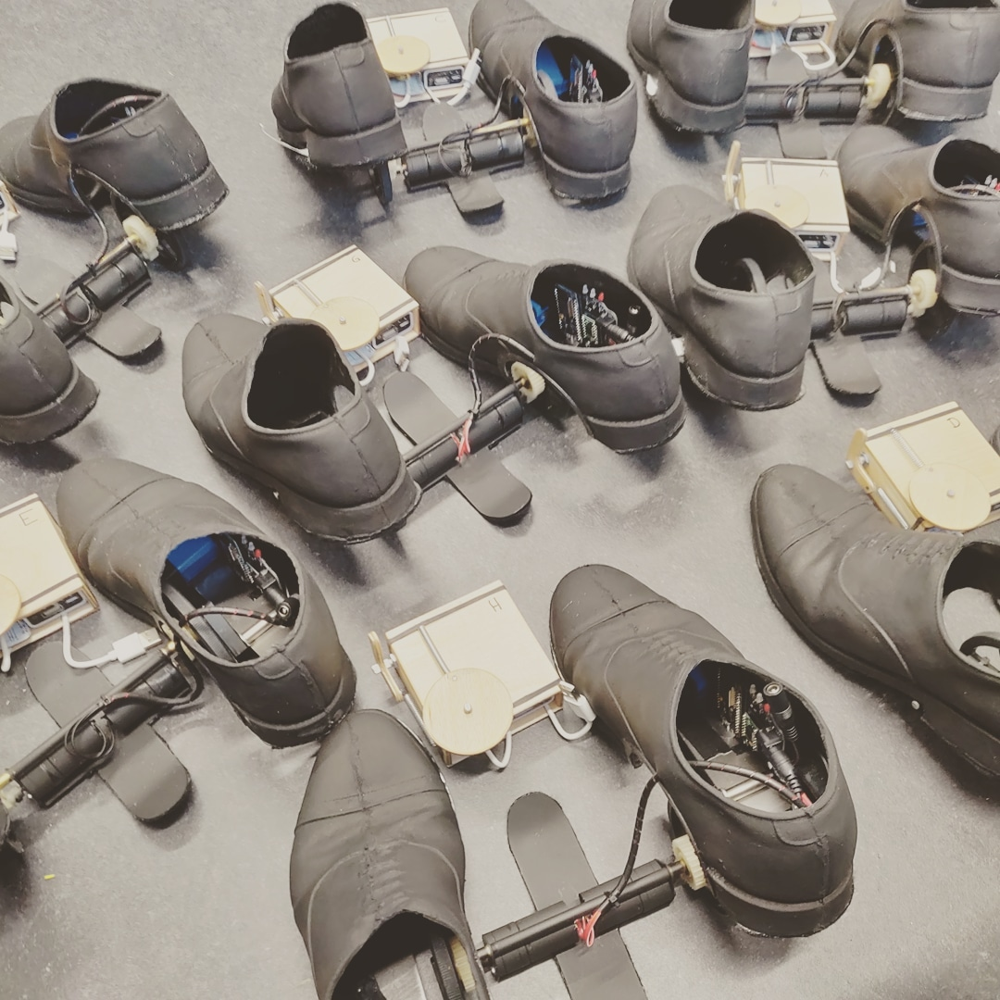

# KafkaShoes
Mechanical Shoes for theatre play "Kafka - Der Prozess" at Theater St. Gallen/Switzerland. Ten pair of these shoes were produced at departement of contemporary puppetry arts at Ernst Busch school for performing arts in Berlin/Germany and animated by puppetry students at named play. 

The electronics, firmware and parts of the hardware can be found here in this repository. It would be difficult to recreate them exactly the same way and is more meant as a learning ressource and inspiration.

## Hardware and electronics

Shoes themselves are made of rubber/latex with a lasered steel base. Two geared motors conrol the movement. LiPo battery is hidden in the right shoe.

The sender works with an ESP32 microcontroller, the shoe itself with an ESP8266. Not using the same microcontroller had historical reasons - they were not meant to be controlled via remote control but over WiFi and we had spare ESP8266. The remote control needed at least two analog inputs which the ESP8266 does not provide, so ESP32 was used.

## Software

Today the ESPs are connected via the ESPNOW protocol. First versions were using UDP/IP with OSC Messages.